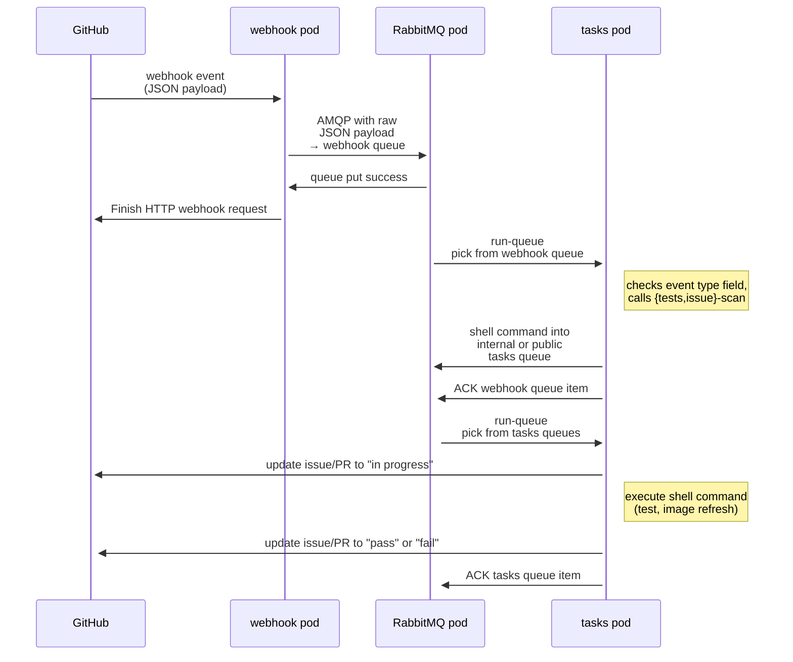

# Cockpit Continuous Integration tasks

This is the [container](./container) and deployment scripts for the Cockpit
integration tests and automated maintenance tasks.

The container has optional mounts:

 * A directory for image files. Defined by `$COCKPIT_IMAGES_DATA_DIR` env
   variable, conventionally `/cache/images`. On production hosts, this is
   mounted from `/var/cache/cockpit-tasks/images`.
 * S3 access tokens for image and log buckets. Defined by `$COCKPIT_S3_KEY_DIR`
   env variable, conventionally `/run/secrets/s3-keys`.
   On production hosts, this is mounted from `/var/lib/cockpit-secrets/tasks/s3-keys`.
 * A directory for GitHub and AMQP secrets. Used by both the tasks and the the webhook container.
   Must be in `/run/secrets/webhook` (bots currently assumes that).
   * `.config--github-token`: GitHub token to create and update issues and PRs.
   * `amqp-{client,server}.{pem,key}`: TLS certificates for RabbitMQ
   * `ca.pem`: The general cockpit CI Certificate Authority which signed the above AMQP certificates
   On production hosts, this is mounted from `/var/lib/cockpit-secrets/webhook`.

To generate the [certificates needed for cross-cluster AMQP](https://www.rabbitmq.com/ssl.html) authentication,
run the [credentials/webhook/generate.sh script](./credentials/webhook/generate.sh) script.
This requires a generic "Cockpit CI" certificate authority first, so if you
don't have that yet, run [credentials/generate-ca.sh](./credentials/generate-ca.sh) first.
Run either script in the target directory (e.g.
`/var/lib/cockpit-secrets/webhook/`).

# Deploying/updating on our CI infrastructure

This happens through [Ansible](../ansible/) depending on the target cloud.
These tasks containers controlled by systemd units `cockpit-tasks@*`.

# Deploying on OpenShift

OpenShift primarily runs the GitHub webhook responder and AMQP server.

As `/dev/kvm` support on OpenShift is hard to come by, current bots
`job-runner` and the deployment resources currently only support a tasks
container which processes the `statistics` and `webhook` queues.

You need a persistent shared volume for `test-results.db` and the Prometheus
database. Create it with

    oc create -f tasks/images-claim-centosci.yaml

Now create all the remaining kubernetes objects. The secrets are created from
the `/var/lib/cockpit-secrets/*` directories as described above:

    make tasks-secrets | oc create -f -
    oc create -f tasks/cockpit-tasks-webhook.json
    oc create -f tasks/cockpit-tasks-centosci.json

## Troubleshooting

Some helpful commands:

    oc describe rc
    oc describe pods
    oc log -f cockpit-tasks-xxxx

# Deploying locally for development, integration tests

For hacking on the webhook, task container, bots infrastructure,, or validating
new container images, you can also run a [podman pod](http://docs.podman.io/en/latest/pod.html)
locally with  RabbitMQ, webhook, minio S3, and tasks containers.
Without arguments this will run some purely local integration tests:

    tasks/run-local.sh

This will also generate the secrets in a temporary directory, unless they
already exist in `tasks/credentials/`. By default this will use the
[`ghcr.io/cockpit-project/tasks:latest`](https://ghcr.io/cockpit-project/tasks)
container, but you can run a different tag by setting `$TASKS_TAG`.

You can also test the whole GitHub → webhook → tasks → GitHub status workflow
on some cockpituous PR with specifying the PR number and a GitHub token:

    tasks/run-local.sh -p 123 -t ~/.config/cockpit-dev/github-token

This will run tests-scan/tests-trigger on the given PR and trigger an
[unit-tests](../.cockpit-ci/run) test which simply does `make check`.

You can get an interactive shell with

    tasks/run-local.sh -i

to run things manually. For example, use `publish-queue` to inject a job into
AMQP, or run `job-runner` or some bots command.

# Running with toolbx

This container can also be used for local development with
[toolbx](https://containertoolbx.org/), to get an "official" Cockpit
development environment that's independent from the host:

```sh
toolbox create --image ghcr.io/cockpit-project/tasks cockpit
toolbox enter cockpit
```

# Running single container with production-like resources

When you want to debug a problem with a test which may be sensitive to its
particular resource configuration (such as calibrating RAM, /dev/shm sizes, or
behaviour of libvirt in a container, etc.), you can run the tasks container
directly with podman. The production parameters are set in the
`job-runner.toml` file in the
[tasks-systemd Ansible role](../ansible/roles/tasks-systemd/tasks/main.yml).
You don't need secrets, custom networks, or most environment settings, the
crucial parts are the memory, device, and image cache configurations.

If you want to share your host's image cache (which is really a good idea),
temporarily make it writable to the unprivileged user in the container:

```sh
chmod o+w ~/.cache/cockpit-images
```

Scaled down to a quarter of the size (to fit on a laptop), you can then run the
container like this:

```sh
podman run -it --rm --device=/dev/kvm --memory=6g --pids-limit=4096 --shm-size=256m \
    --security-opt label=disable -v ~/.cache/cockpit-images:/cache/images \
    -e TEST_JOBS=2 ghcr.io/cockpit-project/tasks bash
```

Inside, you can then run a test, for example
```sh
git clone https://github.com/cockpit-project/cockpit-podman
cd cockpit-podman/
test/run
```

# GitHub webhook integration

## GitHub setup

Add a webhook to your GitHub project on the Settings → Webhooks page of your project:

 * Set the Payload URL to the DNS host name of the deployed route:

       http://webhook-cockpit.apps.ocp.cloud.ci.centos.org

 * Use the same secret as in `~/.config/github-webhook-token` above.

 * Change the Content Type to `application/json`.

 * Select "Let me select individual events" and let the hook run on "Pull requests" and "Statuses".

See [GitHub development documentation](https://developer.github.com/webhooks/)
for more information.

## Set up bot as collaborator

 * On your project's "Settings → Manage Access" page, invite the [cockpituous user](https://github.com/cockpituous) as a collaborator. This should result in a pending invite.
 * Join our Matrix channel [#cockpit:fedoraproject.org](https://matrix.to/#/#cockpit:fedoraproject.org) and ask Martin Pitt (`pitti`), Allison Karlitskaya (`lis`), or Matej Marusak (`mmarusak`) to log into GitHub as `cockpituous` user and accept the invite on the GitHub org or project's `/invitations` page.

## Set up automatic test triggering

 * In the [Cockpit bots project](https://github.com/cockpit-project/bots), add your project to the [test map](https://github.com/cockpit-project/bots/blob/main/lib/testmap.py). Start with `_manual` tests.
 * Send a first PR to your project and use [bots/tests-trigger](https://github.com/cockpit-project/bots/blob/main/tests-trigger) to trigger the contexts that you want. They should be picked up and run.
 * Once you fix your tests to succeed, adjust the test map again to move them to the "main" branch. From now on, every PR against main will automatically trigger these tests.

## Automated testing

When a pull request event or a status event is received, the webhook will
trigger tests for the tasks bots (see "Event flow" below for details).

A pull request event is queued when the pull request is opened or synchronized.
A status event is only queued where the description ends with "(direct
trigger)".

## Event flow for PRs and issues

We don't directly connect webhook events to tasks bots, as workers come and
go, and fail quite often; also, we need something to schedule the incoming
requests across all available workers.

So we put the webhook events into
[AMQP](https://en.wikipedia.org/wiki/Advanced_Message_Queuing_Protocol) queues.
AMQP provides a distributed, transactional, and fail-safe work queue, provides
the scheduling for free, and is really easy to set up.

<!-- you can edit this interactively on https://mermaid.live -->


 * Project configures a webhook for the interesting bits; most importantly
   "pull request opened or pushed" and "issue changed".

 * A PR is opened/changed in a project, or an issue gets a bot-related task
   (e. g. "fetch new translations" or "check for NPM updates"). GitHub sends a
   webhook event of the corresponding type.

 * The webhook calls an OpenShift route, e. g.

      http://webhook-cockpit.apps.ocp.cloud.ci.centos.org/

   This is a route/service that gets that HTTP request to a pod that has (1) an
   off-the-shelf [RabbitMQ container](https://hub.docker.com/_/rabbitmq), and
   (2) a cockpit/tasks container that runs the actual
   [webhook](https://github.com/cockpit-project/cockpituous/blob/main/tasks/webhook).

   See the [Kubernetes resources](./cockpit-tasks-webhook.yaml)
   for details about the route, service, and pod.

   That webhook is a fairly straightforward piece of Python that routes the
   various event types to `handle_{pull_request,issues,...}()` handlers
   and essentially just connect to the AMQP pod next to it
   (amqp.frontdoor.svc:5671) and put the payload into the "webhook" queue.

   This initial step involves no complicated logic or interpretation, and just
   puts the payload into a safe place. The reason for this indirection with one
   interpret-queue (the webhook queue) and several task queues, is to reduce
   load on the webhook. The interpreting of status events for instance can take
   up to 10 seconds and can fail, and HTTP requests ought to be replied fast
   and reliably.

 * Then all worker bots also connect to the same AMQP container (locally
   through the service or remotely through the route).
   [run-queue](https://github.com/cockpit-project/bots/tree/main/run-queue)
   consumes a queue entry, does its thing (see below), and once everything is done it
   acks the entry back to the AMQP server. If anything goes wrong in between
   and the worker crashes, AMQP automatically puts the item back into the
   queue.

   Authentication to AMQP happens through client-side SSL certificates; we have a
   [distributed_queue.py](https://github.com/cockpit-project/bots/blob/main/task/distributed_queue.py)
   convenience wrapper for this.

 * Some cockpit/tasks bot picks up the event payload from the "webhook" queue,
   and interprets it with [tests-scan](https://github.com/cockpit-project/bots/blob/main/tests-scan)
   or [issue-scan](https://github.com/cockpit-project/bots/blob/main/issue-scan)
   depending on the event type. This results in a
   [job-runner JSON task](https://github.com/cockpit-project/bots/blob/main/job-runner)
   or a shell command like `prometheus-stats`, or similar. If this involves any
   Red Hat internal resources, like RHEL images, that command gets put into the
   "internal" queue, otherwise into the "public" queue.

 * Some cockpit/tasks bot picks up the task from the internal or
   public queue (depending on whether it has access to Red Hat internal
   infrastructure), executes it, publishes the log, updates the GitHub status,
   and finally acks the queue item.
