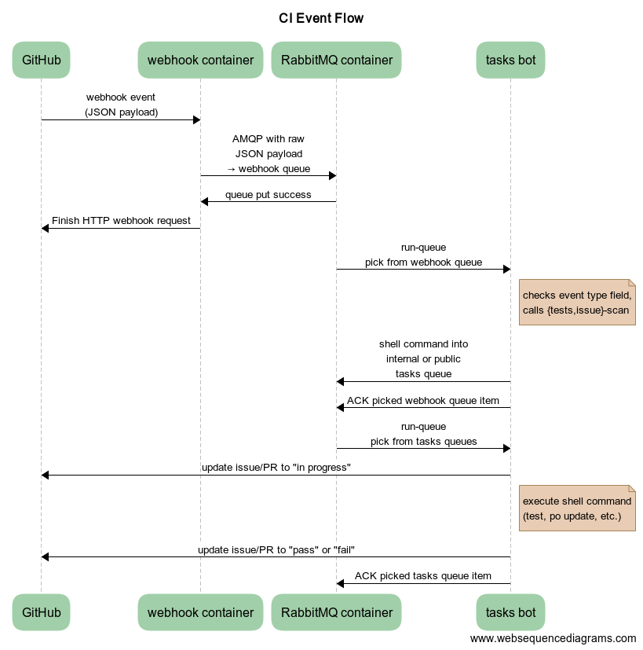

# Cockpit Continuous Integration tasks

This is the staging container and configuration for the Cockpit integration
tests and automated maintenance tasks. This documentation is for deployment on
Fedora 22+ or RHEL 7+.

Use the following commands to run the tasks container as a one off:

    $ sudo yum -y install docker atomic oci-kvm-hook
    $ sudo systemctl start docker
    $ sudo atomic run cockpit/tasks

The container has optional mounts:

 * `/secrets`: A directory for tasks specific secrets, with at least the following files:
   * `ssh-config`: SSH configuration file containing a 'sink' host
   * `image-stores`: Non default locations to try downloading images from (optional)
 * `/run/secrets/webhook`: A directory for secrets shared with the webhook container, with the following files:
   * `.config--github-token`: GitHub token to create and update issues and PRs
 * `/cache`: A directory for reusable cached data such as downloaded image files

The mounts normally default to `/var/lib/cockpit-secrets/tasks`,
`/var/lib/cockpit-secrets/webhook`, and `/var/cache/cockpit-tasks` on the host.

# Deploying on a host

For testing machines that publish back results create a file called
`/var/lib/cockpit-secrets/tasks/ssh-config` as follows, and place `id_rsa`
`id_rsa.pub` `authorized_keys` and a `github-token` in the same directory.

    UserKnownHostsFile /secrets/authorized_keys
    Host sink
        HostName fedorapeople.org
        IdentityFile /secrets/id_rsa
        User cockpit

To transfer secrets from one host to another, you would do something like:

    $ SRC=user@source.example.com
    $ DEST=user@source.example.com
    $ ssh $SRC sudo tar -czhf - /var/lib/cockpit-secrets/tasks/ | ssh $DEST sudo tar -C / -xzvf -

Make sure docker and atomic are installed and running:

    $ sudo systemctl enable docker
    $ sudo atomic install cockpit/tasks

You may want to customize things like the operating system to test or number of jobs:

    $ sudo mkdir -p /etc/systemd/system/cockpit-tasks@.service.d
    $ sudo sh -c 'printf "[Service]\nEnvironment=TEST_JOBS=4\n" > /etc/systemd/system/cockpit-tasks@.service.d/jobs.conf'
    $ sudo sh -c 'printf "[Service]\nEnvironment=TEST_CACHE=/mnt/nfs/share/cache\n" > /etc/systemd/system/cockpit-tasks@.service.d/cache.conf'
    $ sudo systemctl daemon-reload

And now you can restart the service:

    $ sudo systemctl restart cockpit-tasks@*

To generate the certificates needed for cross-cluster amqp auth follow this
guide:

    https://www.rabbitmq.com/ssl.html

## Troubleshooting

Some helpful commands:

    # journalctl -fu cockpit-tasks@*
    # systemctl stop cockpit-tasks@*

## Updates

To update, just pull the new container and restart the cockpit-tasks service.
It will restart automatically when it finds a pause in the verification work.

    # docker pull docker.io/cockpit/tasks

## Deploying on Openshift

The testing machines can run on Openshift cluster(s).

Create a service account for use by the testing machines. Make sure to have the
`oci-kvm-hook` package installed on all nodes.  This is because of the requirement
to access `/dev/kvm`. Further work is necessary to remove this requirement.

    $ oc create -f tasks/cockpituous-account.json
    $ oc adm policy add-scc-to-user anyuid -z cockpituous
    $ oc adm policy add-scc-to-user hostmount-anyuid -z cockpituous

Now create all the remaining kubernetes objects. The secrets are created from
the `/var/lib/cockpit-secrets/tasks` directory as described above. For the
webhook secrets a github token `~/.config/github-webhook-token` should be
present.

    $ sudo make tasks-secrets | oc create -f -
    $ oc create -f tasks/cockpit-tasks.json

## Troubleshooting

Some helpful commands:

    $ oc describe rc
    $ oc describe pods
    $ oc log -f cockpit-tasks-xxxx

The tests need `/dev/kvm` to be accessible to non-root users on each node:

    $ sudo modprobe kvm
    $ printf 'kvm\n' | sudo tee /etc/modules-load.d/kvm.conf
    $ sudo chmod 666 /dev/kvm
    $ printf 'KERNEL=="kvm", GROUP="kvm", MODE="0666"\n' | sudo tee /etc/udev/rules.d/80-kvm.rules

Some of the older tests need ip6_tables to be loaded:

    $ sudo modprobe ip6_tables
    $ printf 'ip6_tables\n' | sudo tee /etc/modules-load.d/ip6_tables.conf

Some tests need nested virtualization enabled:

    $ sudo -s
    # echo "options kvm-intel nested=1" > /etc/modprobe.d/kvm-intel.conf
    # echo "options kvm-amd nested=1" > /etc/modprobe.d/kvm-amd.conf
    # ( rmmod kvm-intel && modprobe kvm-intel ) || ( rmmod kvm-amd && modprobe kvm-amd )

SELinux needs to know about the caching directories:

    # chcon -Rt svirt_sandbox_file_t /var/cache/cockpit-tasks/

Service affinity currently wants all the cockpit-tasks pods to be in the same region.
If you have your own cluster make sure all the nodes are in the same region:

    $ oc patch node node.example.com -p '{"metadata":{"labels": {"region": "infra"}}}'

## Scaling

We can scale the number of testing machines in the openshift cluster with this
command:

    $ oc scale rc cockpit-tasks --replicas=3

## GitHub webhook integration

### GitHub setup

Add a webhook to your GitHub project on the Settings → Webhooks page of your project:

 * Set a Payload URL like

       http://webhook-cockpit.apps.ci.centos.org/tools/cockpituous

   using the URL of the deployed route, and the path to the release script of
   the corresponding project's git tree (the git repository URL will be taken
   from the POST data that GitHub sends).

 * Use the same secret as in `~/.config/github-webhook-token` above.

 * Change the Content Type to `application/json`.

 * Select "Let me select individual events" and let the hook run on "Branch or
   tag creation", "Pull requests", and "Statuses".

See [GitHub development documentation](https://developer.github.com/webhooks/)
for more information.

### Set up bot as collaborator

 * On your project's "Settings → Manage Access" page, invite the [cockpituous user](https://github.com/cockpituous) as a collaborator.
 * Once you see the "Pending invite", in the list, the clipboard symbol copies the corresponding `/invitations` URL to the clipboard. Send that to Martin Pitt (`pitti` in `#cockpit` on FreeNode IRC) or Marius Vollmer (`mvollmer` on IRC), who will log into GitHub as `cockpituous` user and accept the invite.

### Set up automatic test triggering

 * In the [Cockpit bots project](https://github.com/cockpit-project/bots), add your project to the [test map](https://github.com/cockpit-project/bots/blob/master/task/testmap.py). Start with `_manual` tests.
 * Send a first PR to your project and use [bots/tests-trigger](https://github.com/cockpit-project/bots/blob/master/tests-trigger) to trigger the contexts that you want. They should be picked up and run.
 * Once you fix your tests to succeed, adjust the test map again to move them to the "master" branch. From now on, every PR against master will automatically trigger these tests.

### Automated releases

Whenever a new release tag gets pushed to a project a "create" event is received
by the webhook which automatically starts a release runner.

### Automated testing

When a pull request event or a status event is received, the webhook will
trigger tests for the tasks bots (see "Event flow" below for details).

A pull request event is queued when the pull request is opened or synchronized.
A status event is only queued where the description ends with "(direct
trigger)".

### Event flow for PRs and issues

We don't directly connect webhook events to tasks bots, as workers come and
go, and fail quite often; also, we need something to schedule the incoming
requests across all available workers.

So we put the webhook events into
[AMQP](https://en.wikipedia.org/wiki/Advanced_Message_Queuing_Protocol) queues.
AMQP provides a distributed, transactional, and fail-safe work queue, provides
the scheduling for free, and is really easy to set up.

 * Project configures a webhook for the interesting bits; most importantly
   "pull request opened or pushed" and "issue changed". (We use "branch or tag
   creation as well, but releases have a different flow not shown here).

 * A PR is opened/changed in a project, or an issue gets a bot-related task
   (e. g. "fetch new translations" or "check for NPM updates"). GitHub sends a
   webhook event of the corresponding type.

 * The webhook calls an OpenShift route, e. g.

      http://webhook-cockpit.apps.ci.centos.org/cockpituous-release

   This is a route/service that gets that HTTP request to a pod that has (1) an
   off-the-shelf [RabbitMQ container](https://hub.docker.com/_/rabbitmq), and
   (2) a cockpit/tasks container that runs the actual
   [webhook](https://github.com/cockpit-project/cockpituous/blob/master/tasks/webhook).

   See the [Kubernetes resources](https://github.com/cockpit-project/cockpituous/blob/master/tasks/cockpit-tasks-webhook.yaml)
   for details about the route, service, and pod.

   That webhook is a fairly straightforward piece of Python that routes the
   various event types to `handle_{pull_request,create,issues,...}()` handlers
   and essentially just connect to the AMQP pod next to it
   (amqp.frontdoor.svc:5671) and put the payload into the "webhook" queue.

   This initial step involves no complicated logic or interpretation, and just
   puts the payload into a safe place. The reason for this indirection with one
   interpret-queue (the webhook queue) and several task queues, is to reduce
   load on the webhook. The interpreting of status events for instance can take
   up to 10 seconds and can fail, and HTTP requests ought to be replied fast
   and reliably.

 * Then all real test/release/etc. worker bots also connect to the same AMQP
   container (locally through the service or remotely through the route).
   [run-queue](https://github.com/cockpit-project/bots/tree/master/run-queue)
   consumes a queue entry, does its thing (see below), and once everything is done it
   acks the entry back to the AMQP server. If anything goes wrong in between
   and the worker crashes, AMQP automatically puts the item back into the
   queue.

   Authentication to AMQP happens through client-side SSL certificates; we have a
   [distributed_queue.py](https://github.com/cockpit-project/bots/blob/master/task/distributed_queue.py)
   convenience wrapper for this.

 * Some cockpit/tasks bot picks up the event payload from the "webhook" queue,
   and interprets it with [tests-scan](https://github.com/cockpit-project/bots/blob/master/tests-scan)
   or [issue-scan](https://github.com/cockpit-project/bots/blob/master/issue-scan)
   depending on the event type. This results in a shell command like
   `tests-invoke [...]`, `npm-update [...]`, or similar. If this involves any
   Red Hat internal resources, like RHEL or Windows images, that command gets
   put into the "internal" queue, otherwise into the "public" queue.

 * Some cockpit/tasks bot picks up the shell command from the internal or
   public queue (depending on whether it has access to Red Hat internal
   infrastructure), executes it, publishes the log, updates the GitHub status,
   and finally acks the queue item.
